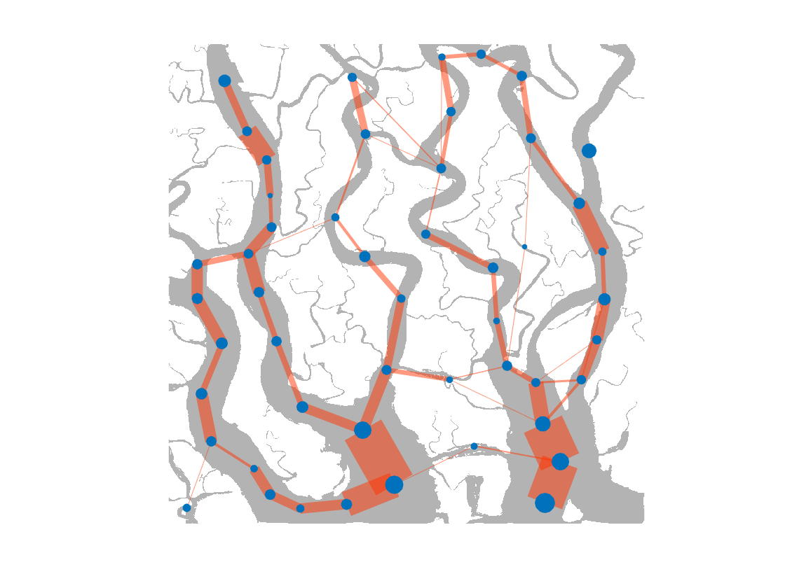
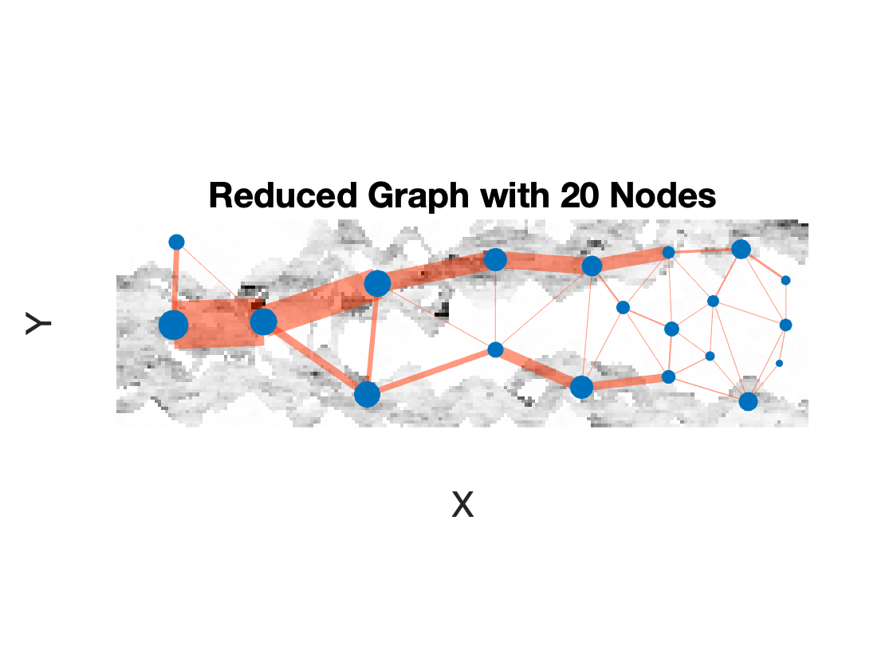
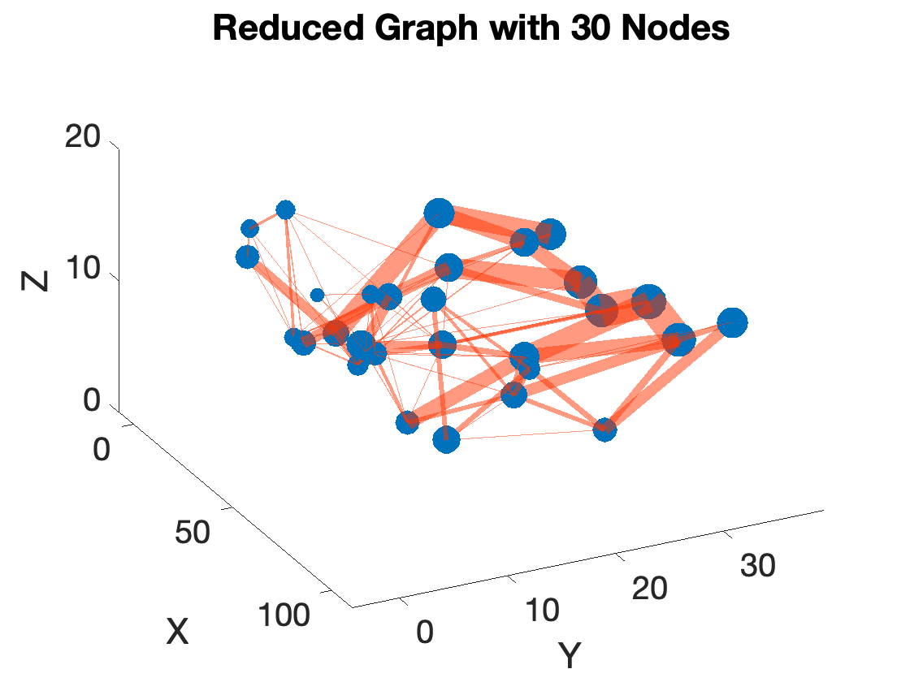

# geologyMapper

Mapping of geological structure to graphs

**topoMapper.m** is the mapper from binary 2D/3D images to graphs.

**permTopoMapper.m** is the mapper from continuous 2D/3D images to graphs. Permeability fields should be on the order of mD, and is for now assumed to be isotropic.

**computeLaplacianEV.m** computes the graph Laplacian eigenvalues

**runExample.m** compiles the mex files and runs a few examples

The implementation of the Fast Marching Method in the toolbox_general folder is written by Gabriel Peyre

## 2D example, binary geology

## 2D example, heterogeneous porous media

## 3D example, heterogeneous porous media

